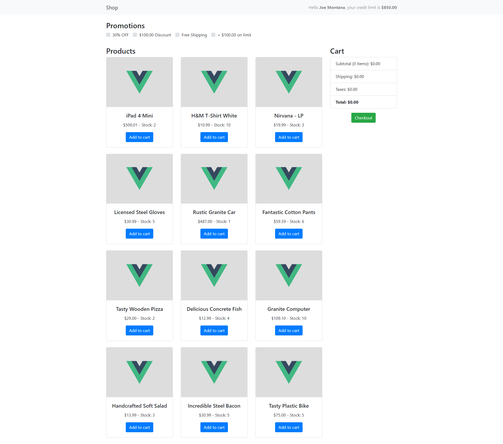

# Shop-vue

It's just a shopping cart experiment using Vue.js and CDN bootstrap library.

- [See it live!](http://matheusazzi.com/shopping-cart/)

This project is built with [vue-cli](https://github.com/vuejs/vue-cli) and [vuex](https://github.com/vuejs/vuex).

Also, I suggest you to use [vue-devtools](https://github.com/vuejs/vue-devtools) if you want a see how everything happens.

### How promotions work

- 30% OFF should reduce 30% of the costs on **subtotal**.
- $100.00 Discount should reduce $100.00 of **total**.
- Free Shipping should set **shipping** to zero.
- +$100.00 on limit should increase user **limit** by $100.00.

### We have 3 resources:




##### Profile

```js
{
  'firstName': 'Joe',
  'lastName': 'Montana',
  'limit': 850.00
}
```

##### Products

```js
{
  'id': 1,
  'title': 'iPad 4 Mini',
  'price': 500.01,
  'inventory': 2,
  'shipping': 15.00
},
...
```

##### Promotions

```js
{ 'id': 1, 'title': '30% OFF' },
{ 'id': 2, 'title': '$100.00 Discount' },
{ 'id': 3, 'title': 'Free Shipping' },
{ 'id': 4, 'title': '+ $100.00 on limit' }
```

## Project setup
```
yarn install
```

### Compiles and hot-reloads for development
```
yarn run serve
```

### Compiles and minifies for production
```
yarn run build
```

### Run your tests
```
yarn run test
```

### Lints and fixes files
```
yarn run lint
```

### Run your end-to-end tests
```
yarn run test:e2e
```

### Run your unit tests
```
yarn run test:unit
```

Published by Maximus
